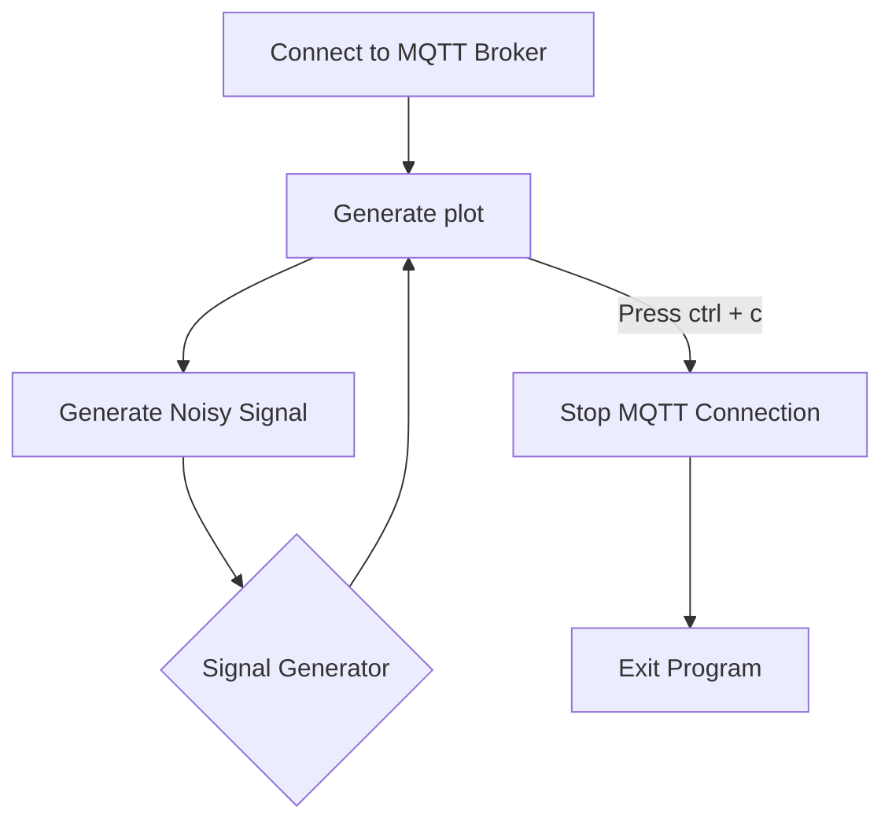

# Semester Project

This is the semester project for the course PROCTECH 4IT3, **McMaster University**.

## Description

This completed project will have focused on the completion of a full dynamic website and will have  required the integration of multiple components (Shown below).


## Getting started

1. Create a new **PYTHON** project
2. Clone down this repository
3. Create a new repository in your GitLab group called *Project*
4. Remove this repository as a remote
5. Add the Remote Repository to your new repository in GitLab

## Requirements
1. Install the requirements file using:

   ```commandline
   pip install -r requirements.txt
   ```
   
## Docker
1. The docker file is used to create a container that will run the MySQL server, PHPMyAdmin,redis server, nginx server
      and a  django server.
   - Mysql server 
   - PHPMyAdmin
   - Redis server
   - Nginx server
   - Django server
   
   * Change the [my.cnf](Semester_Project/configs/my.cnf) to reflect the username and password for your mysql instance.
2. Run the MySQL file(s):

   * [1 - setup_db.sql](sql_scripts/configure_database.sql) this will configure the database
   * [2 - phpmyadmin.sql](sql_scripts/phpmyadmin.sql) <-- Only if you have a PHPMyAdmin instance
3. Run the following commands

```PowerShell
py manage.py makemigrations
py manage.py migrate
```

## Successful Execution of Docker Container should look like this


## Software Execution Flow for signal generator



## Sample Sinwave Generator 
```Python 
x = np.linspace(0.0, N*T, N, endpoint=False)
y = np.sin(50.0 * 2.0*np.pi*x) + 0.5*np.sin(80.0 * 2.0*np.pi*x)
```

[Reference](https://docs.scipy.org/doc/scipy/tutorial/fft.html)


## Class (Signal)

- Generate Signal
  - Expecting to generate a signal that is used to simulate a vibrating item
  - 
## Class (MQTT)

- Client Connection

  - Configure and connect to the specified client during message for the particular signal.
    Note that there might be multiple streams
- Public Variable (**CONF**)

  - Include the Stream Information
  - Include the Server Information
  - Include the Client

## Class (ACK)
- Error Handling if things fail
  - What to do with the data
  - Where to send the data to if it's not working
