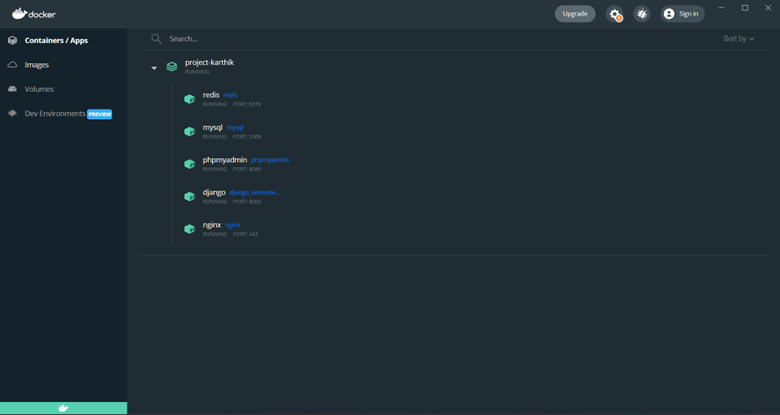
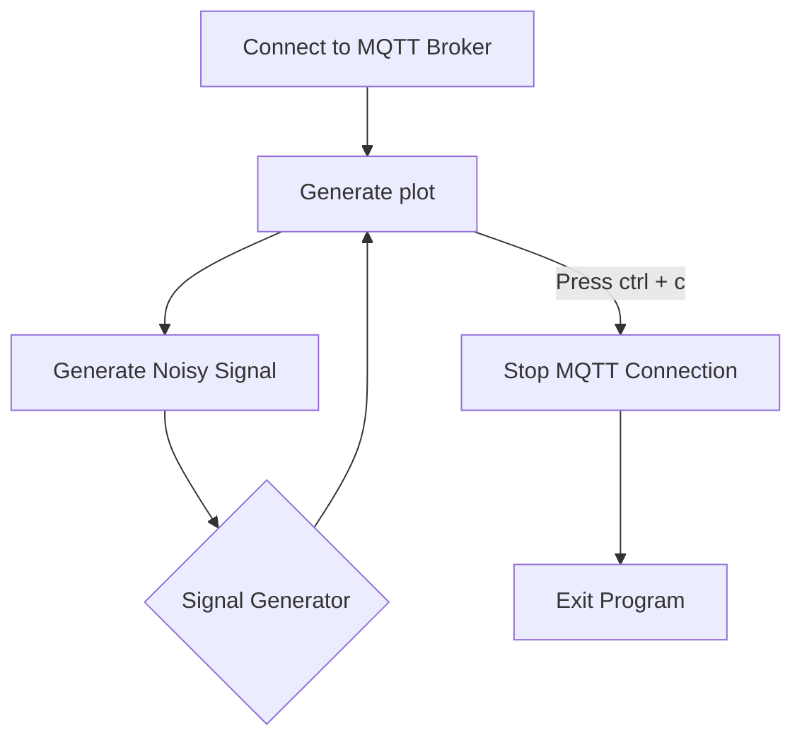

An example of the project working can be found [dev.karthikthovinakere.tech](http://dev.karthikthovinakere.tech:8000/) 


## Description

This completed project will have focused on the completion of a full dynamic website and will have  required the integration of multiple components (Shown below).

Key Aspects of this project are:

* [ ]  Dockerization
* [ ]  User authentication with an added service of being able to change info.
* [ ]  Model implementation and SQL Query Generation done showcasing a sinewave and ECGsignal generation
* [ ]  REST API implementation
* [ ]  MQTT Module integrations
* [ ]  Front-end and back-end data manipulation through the use of HTML pages and RAW data implementation from MQTT


## Getting started

1. Create a new **PYTHON** project
2. Clone down this repository
3. Create a new repository in your GitLab group called *Project*
4. Remove this repository as a remote
5. Add the Remote Repository to your new repository in GitLab

## Requirements

1. Activate the virtual environment
2. Install the requirements file using:

   ```commandline
   pip install -r requirements.txt
   ```

## Docker

```commandline
  docker-compose up -d
```

1. The docker file is used to create a container that will have the following:

   - Mysql server
   - PHPMyAdmin
   - Redis server
   - Nginx server
   - Django server

## Successful Execution of Docker Container should look like this



## Configs and Environment Variables

1. Change the [my.cnf](Semester_Project/configs/my.cnf) to reflect the username and password for your mysql instance.
2. Change the [dotenv](dotenv) to .env to  reflect the username and password for your mysql
   instance.

## SQL Scripts

1. Run the MySQL file(s):

   * [1 - configure_database.sql](sql_scripts/configure_database.sql) this will configure the database
   * [2 - phpmyadmin.sql](sql_scripts/phpmyadmin.sql) <-- Only if you have a PHPMyAdmin instance
     And optionanlly, you can run the following to add limitations to database queries and size.
   * [3 - limit_size.sql](sql_scripts/limit_size.sql) this will limit the size of the database to  about 190MB of
     space.

2. Run the following commands

```PowerShell
py manage.py makemigrations
py manage.py migrate
```

This should now create the database and tables for the project.

## Running the Django Server

1. Run the following command to start the server

```commandline
py manage.py runserver
```

2. The server should now be running on [localhost:8000](http://localhost:8000)

## Software Execution Flow for signal generator



## Sample Sinwave Generator

```Python
x = np.linspace(0.0, N*T, N, endpoint=False)
y = np.sin(50.0 * 2.0*np.pi*x) + 0.5*np.sin(80.0 * 2.0*np.pi*x)
```

[Reference](https://docs.scipy.org/doc/scipy/tutorial/fft.html)
