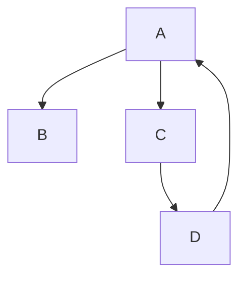

# Project-Karthik

# Steps 
## Signal Generator 

- [ ] Sine wave generated

- [ ] Include some noise

- [ ] Standard Python packages

- [ ] Send a signal to an outside source 


## Python Integration 
## See Requirments.txt
'''TEXt

numpy 

scipy 

pandas

paho-mqtt
'''



| Symbol | Step
| --- | --- |
| A | Generate Sine Wave |
| B | Pass to Mqtt Client |
| C | Specify Server for Sending|
| D | Check the ACK | 


#Sample Sinwave Generator 
```Python 
x = np.linspace(0.0, N*T, N, endpoint=False)
y = np.sin(50.0 * 2.0*np.pi*x) + 0.5*np.sin(80.0 * 2.0*np.pi*x)
```

[Reference](https://docs.scipy.org/doc/scipy/tutorial/fft.html) 


#OOP

## Class (Signal)
- Generate Signal 
   -  Expecting to generate a signal that is used to simulate a vibrating item 
- [Your choice]
   -  Expecting a different 

## Class (MQTT)
- Client Connection 
    - Configure and connect to the specified client during message for the particular signal.
Note that there might be multiple streams 

- Public Variable (**CONF**)
    - Include the Stream Information 
    - Include the Server Information 
    - Incluide the Client 

## Class (ACK)
- Error Handling if things fail 
    - What to do with the data
    - Where to send the data to if its not working


